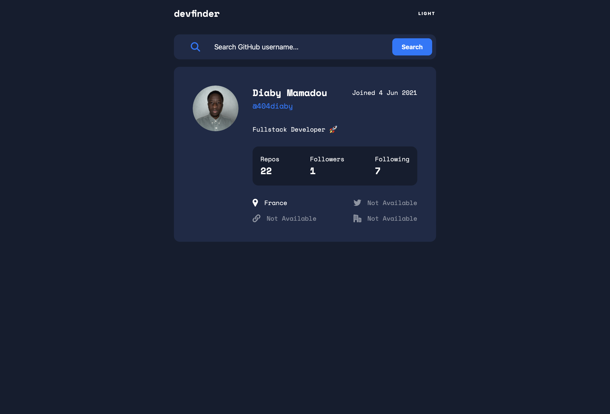
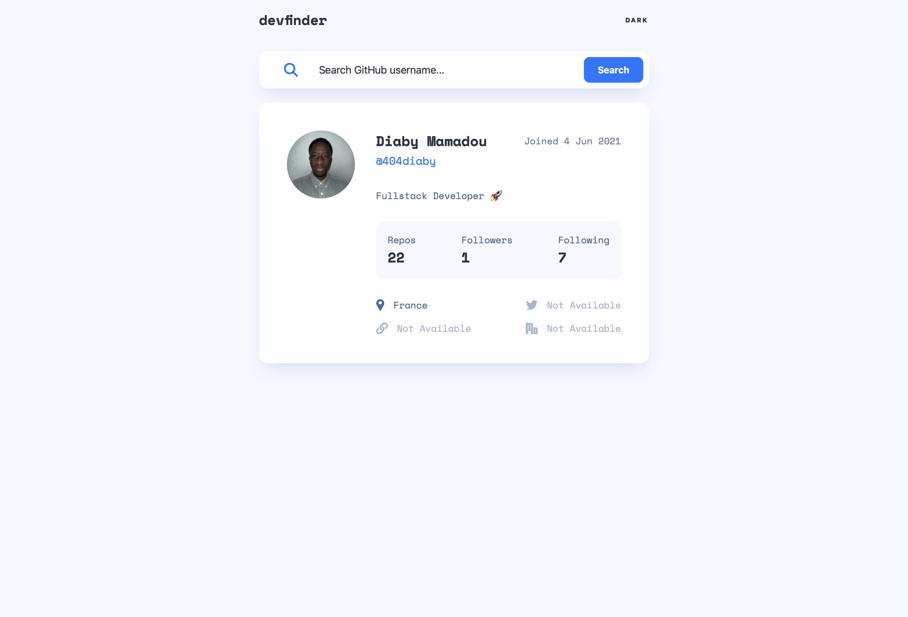
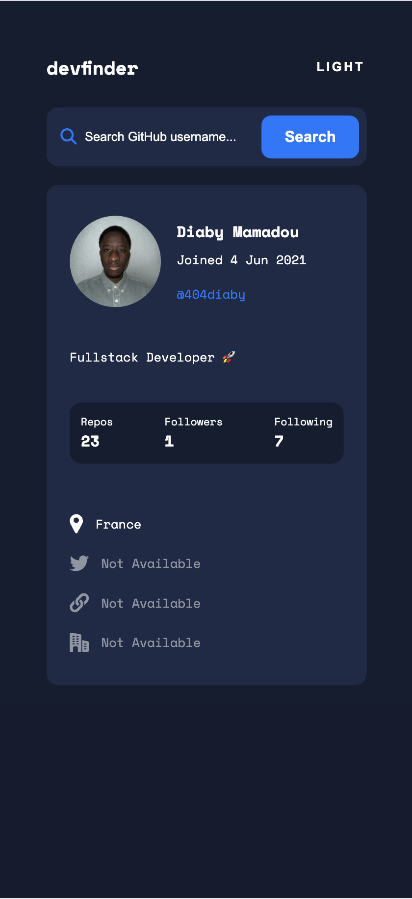
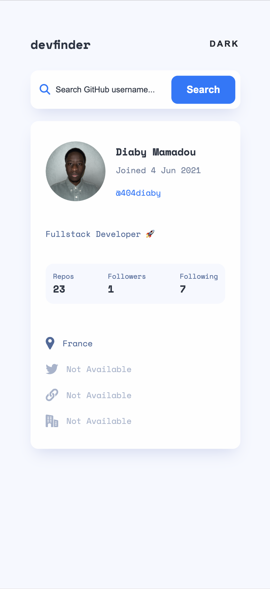

# Devfinder

A simple webpage where user can put in anyone's GitHub username and see their profile information.

 

### Technologies Used

**Client:** JavaScript, CSS, HTML, Fetch API

**Server:** Github API

## Features

- See hover states for all interactive elements on the page
- Search for GitHub users by their username
- See relevant user information based on their search
- Switch between light and dark themes
- Persist theme with localStorage

The GitHub users API endpoint is `https://api.github.com/users/:username`. So, if you wanted to search for the Octocat profile, you'd be able to make a request to `https://api.github.com/users/octocat`.

### Expected behaviour

On first load, show the profile information for `404diaby` (me).

Display an error message, if no user is found when a new search is made.
If a GitHub user hasn't added their name, show their username where the name would be without the @ symbol and again below with the @ symbol.
If a GitHub user's bio is empty, show the text "This profile has no bio" with transparency added.

If any of the location, website, twitter, or company properties are empty, show the text "Not Available" with transparency added.
Website, twitter, and company information should all be links to those resaources. For the company link, it should remove the @ symbol and link to the company page on GitHub. For Octocat, with @github being returned for the company, this would lead to a URL of `https://github.com/github`.

## Getting Started

### Installation

Clone the project

* `git clone https://github.com/your-username/github-user-search.git`

Go to the project directory

* `cd my-project`

### Usage

* Open the application in your web browser: `http://localhost:XXXX`
* Search for GitHub users by their username
* Switch between light and dark themes

## Preview 

 k

## Future Plans

*A roadmap or future plans for features and improvements to the application.*

- optimization et performance
- end user guide ?
- Have the correct color scheme chosen for them based on their computer preferences.
- more refratoring
- node + scrit start + install live server
- add deployment (locally) part in readme

These are just a few ideas to get you started. Remember to prioritize features based on user needs and feedback. Good luck with your project!

## Inspiration

[Kamran Ahmed](https://api.github.com/users/kamranahmedse)

[Frontend Mentor](https://www.frontendmentor.io/challenges/github-user-search-app-Q09YOgaH6)

[NinjaInShade](https://github.com/NinjaInShade/github-user-search)

## Social Links

## Demo

You can try out the TodoList App demo here: 

